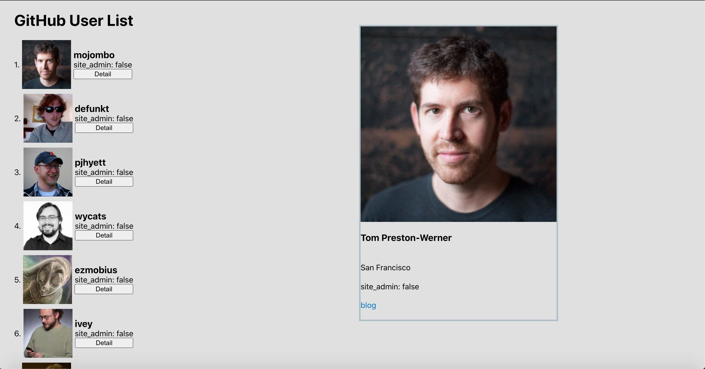

# About
This repository is my practice project about call the api from GitHub REST API v3.

# Screenshots




## Install the dependencies
Install the dependencies by running
```
npm install
```

If you are using [yarn](https://yarnpkg.com/lang/en/), please run
```
yarn install
```
## Running the application
**To run the application, execute**
```
npm start
```
or with [yarn](https://yarnpkg.com/lang/en/)
```
yarn start
```

# Features
* Limit to 100 users
* show user's avatar_url、login、site_admin on list
* click Detail button Detail UI will be shown
* avatar_url、name、bio、login、location、site_admin、blog on Detail UI

# Used technologies
* React / create-react-app
* React Hooks
* React-redux
* Redux
* styled-components
